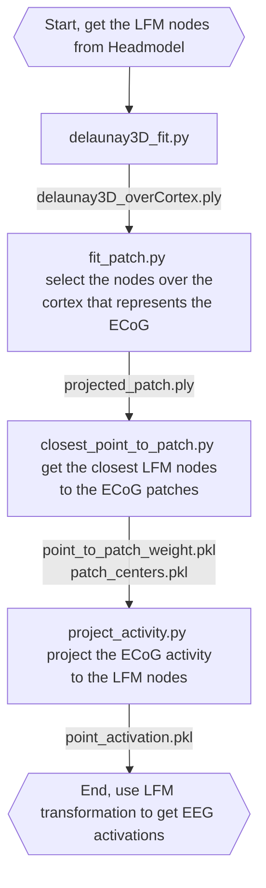

# PointCloud_fun, correlate ECoG activity to Leadfield matrix (LFM)

This repository contains scripts to correlate ECoG activity to Leadfield matrix (LFM) in order to estimate the spatial distribution of the ECoG activity as EEG activity. The hypothesis is that mapping ECoG activity to EEG will help us to understand the ground-truth dynamics of EEG data and help us determine the extent of the ECoG (and cortical) activity that can be captured by EEG.

## Workflow
Here is the general workflow of the scripts:

