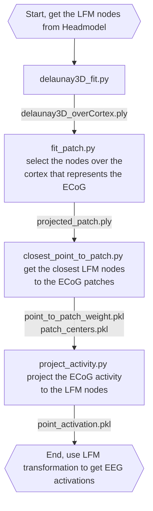

# PointCloud_fun, correlate ECoG activity to Leadfield matrix (LFM)

This repository contains scripts to correlate ECoG activity to Leadfield matrix (LFM) in order to estimate the spatial distribution of the ECoG activity as EEG activity. The hypothesis is that mapping ECoG activity to EEG will help us to understand the ground-truth dynamics of EEG data and help us determine the extent of the ECoG (and cortical) activity that can be captured by EEG.

## Workflow
Here is the general workflow of the scripts:

## Intermediate files
- delaunay3D_overCortex.ply: The Delaunay surface that fits the LFM nodes over the cortex.
- projected_patch.ply: The ECoG patche that is placed over the Delaunay surface.
- point_to_patch_weight.pkl: The weight of each ECoG sub-patch to the LFM nodes.
- patch_centers.pkl: The center of each ECoG sub-patch.
- point_activation.pkl: The ECoG activity projected to the LFM nodes.

The large files are not included in the repository. Before running the scripts, you need to download (at least) the FDT files of your choosing from this **[OneDrive link](https://ucsdcloud-my.sharepoint.com/:f:/r/personal/syshirazi_ucsd_edu/Documents/to%20Share/ECoG/pointcloud_fun%20files?csf=1&web=1&e=YELLDr)**.
